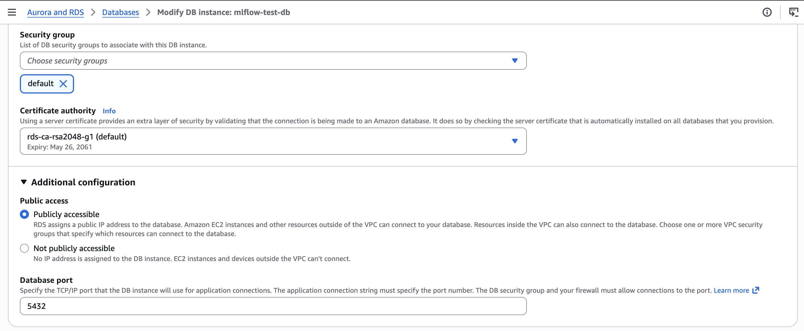
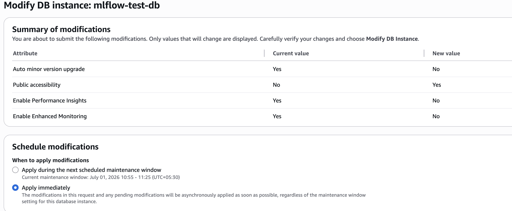
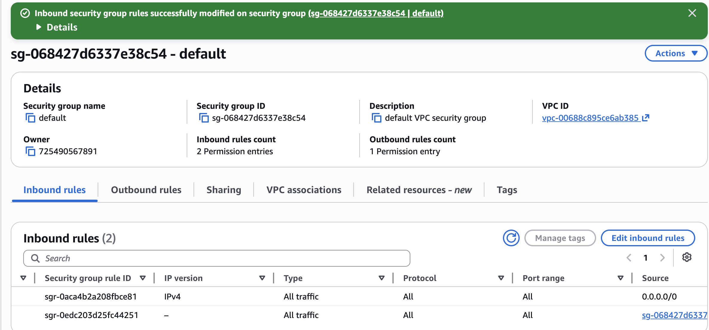
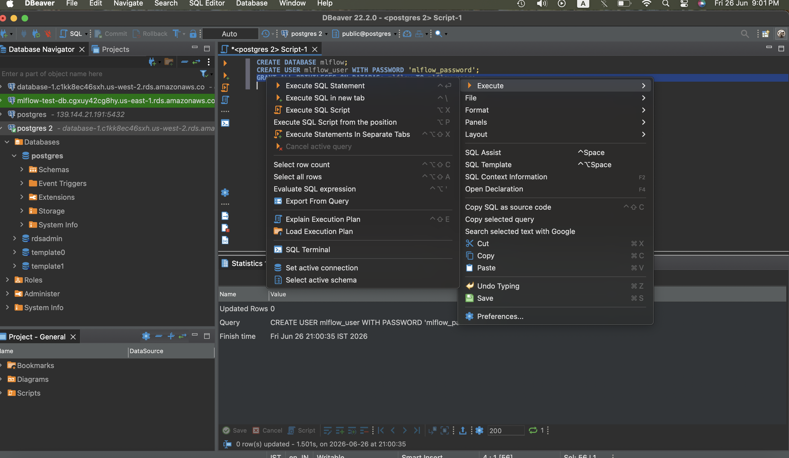
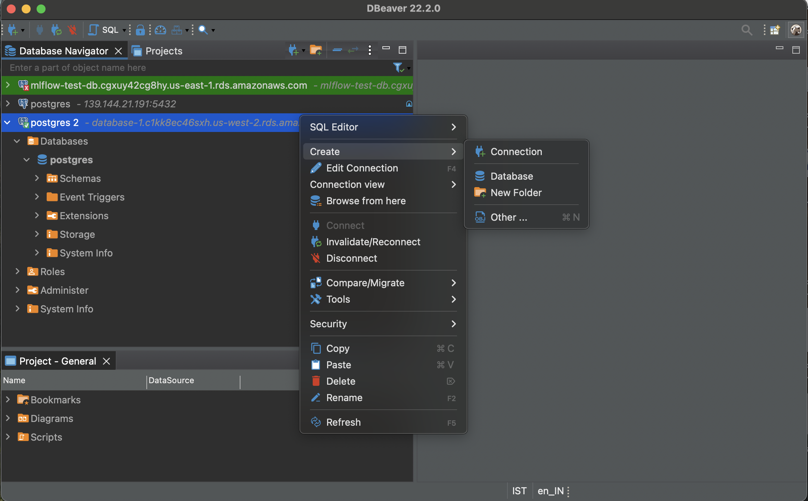
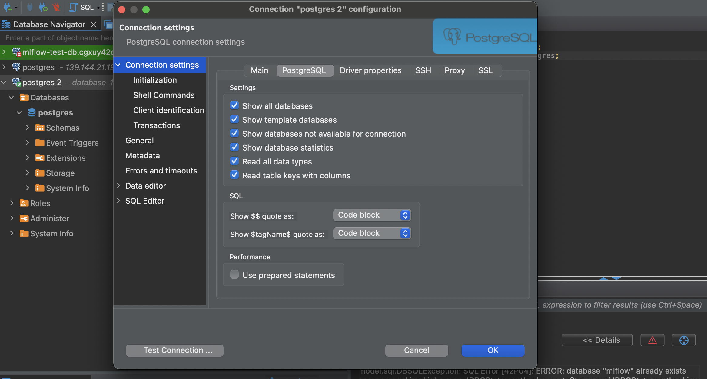
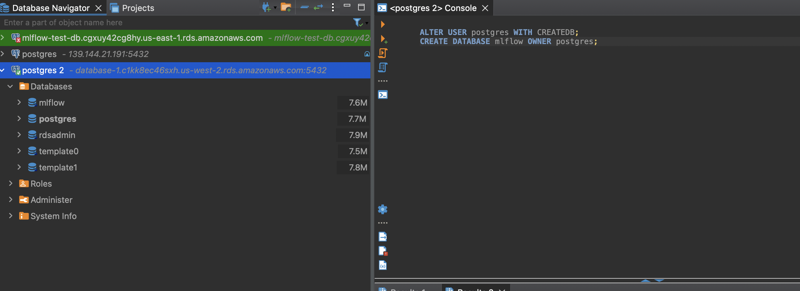
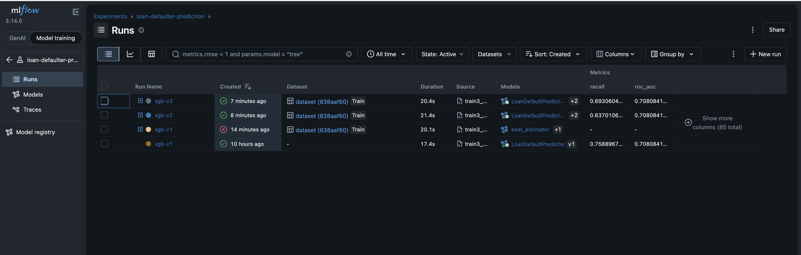
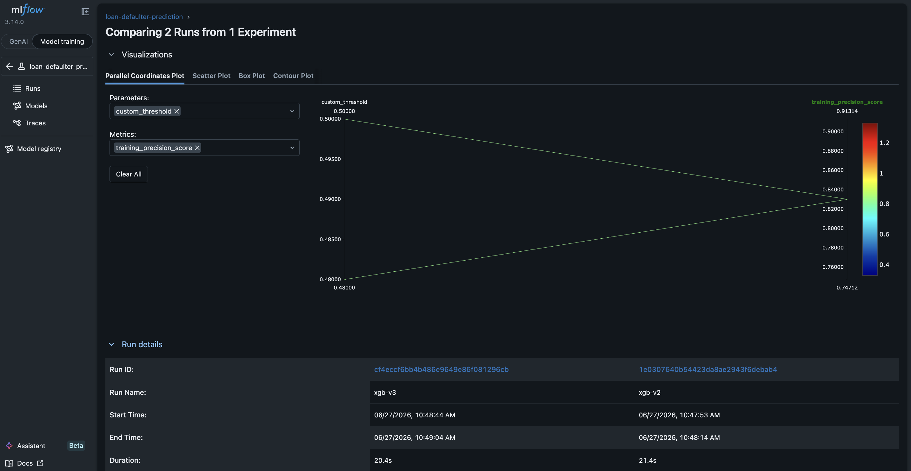
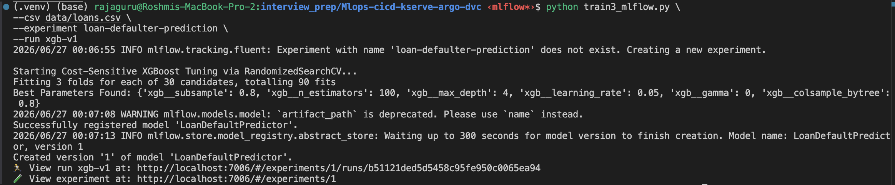

ML_Flow setup :- 

Guide :- https://community-charts.github.io/docs/charts/mlflow/usage
Doc:- https://www.mlflow.org/docs/latest/ml/model-registry/

1. Setup Postgres db in aws
2. modify settings to make the db publickly accessible  :-






CREATE DATABASE mlflow;
CREATE USER mlflow_user WITH PASSWORD 'mlflow_password';
GRANT ALL PRIVILEGES ON DATABASe mlflow TO mlflow_user;



3. connect via dBeaver client and create a mlflow database

nc -zv database-1.c1kk8ec46sxh.us-west-2.rds.amazonaws.com 5432                                                       
Connection to database-1.c1kk8ec46sxh.us-west-2.rds.amazonaws.com port 5432 [tcp/postgresql] succeeded!







4. DB endpoint :- database-1.c1kk8ec46sxh.us-west-2.rds.amazonaws.com , port:- 5432

5. Create eks cluster
   

6. Create service account with rds ans s3 access :-

```
i) aws eks describe-cluster --name test-cluster2 --query "cluster.identity.oidc.issuer" --output text

https://oidc.eks.us-west-2.amazonaws.com/id/9C88E7A274ED7FFD2219F53CB558F1B6

https://oidc.eks.us-west-2.amazonaws.com/id/4265CAC088096602CC31ABA3FA495605

ii) Create the trust policy JSON

aws iam create-role --role-name eks-mlflow-s3-rds-access-role --assume-role-policy-document file://trust-policy.json    


{
 "Version": "2012-10-17",
 "Statement": [
     {
         "Sid": "AllowEKSProvider",
         "Effect": "Allow",
         "Principal": {
             "Federated": "arn:aws:iam::725490567891:oidc-provider/oidc.eks.us-west-2.amazonaws.com/id/9C88E7A274ED7FFD2219F53CB558F1B6"
         },
         "Action": "sts:AssumeRoleWithWebIdentity",
         "Condition": {
             "StringEquals": {
                 "oidc.eks.us-west-2.amazonaws.com/id/9C88E7A274ED7FFD2219F53CB558F1B6:sub": "system:serviceaccount:mlflow:sa-s3-rds-access",
                 "oidc.eks.us-west-2.amazonaws.com/id/9C88E7A274ED7FFD2219F53CB558F1B6:aud": "sts.amazonaws.com"
             }
         }
     }
 ]
}

iii) Attach the permission policy :-

{
    "Statement": [
        {
            "Effect": "Allow",
            "Action": [
                "s3:ListBucket"
            ],
            "Resource": [
                "arn:aws:s3:::mlflow-725490567891"
            ]
        },
        {
            "Effect": "Allow",
            "Action": [
                "s3:GetObject",
                "s3:PutObject",
                "s3:DeleteObject"
            ],
            "Resource": [
                "arn:aws:s3:::mlflow-725490567891/*"
            ]
        },
        {
            "Action": [
                "rds-db:connect"
            ],
            "Effect": "Allow",
            "Resource": [
                "arn:aws:rds:us-west-2:725490567891:db:database-1"
            ]
        }
    ],
    "Version": "2012-10-17"
}

iv) create ns mlflow :-
   k create ns mlflow

v) apply service account :-
   k apply -f k8s/serviceaccount.yaml

vi) create s3 bucket with versioning enabled

vii) instal mlflow :-

helm repo add community-charts https://community-charts.github.io/helm-charts

helm install mlflow community-charts/mlflow \
  --namespace mlflow \
  --set backendStore.databaseMigration=true \
  --set backendStore.postgres.enabled=true \
  --set backendStore.postgres.host=database-1.c1kk8ec46sxh.us-west-2.rds.amazonaws.com \
  --set backendStore.postgres.database=mlflow \
  --set backendStore.postgres.user=postgres \
  --set backendStore.postgres.password='<pass>' \
  --set artifactRoot.s3.enabled=true \
  --set artifactRoot.s3.bucket=mlflow-725490567891 \
  --set serviceAccount.create=false \
  --set serviceAccount.name=sa-s3-rds-access \
  --set extraEnvVars.AWS_DEFAULT_REGION=us-west-2

>.   
NAME: mlflow
LAST DEPLOYED: Thu Jun 25 15:53:25 2026
NAMESPACE: mlflow
STATUS: deployed
REVISION: 1
TEST SUITE: None
NOTES:
1. Get the application URL by running these commands:
  export POD_NAME=$(kubectl get pods --namespace mlflow -l "app.kubernetes.io/name=mlflow,app.kubernetes.io/instance=mlflow" -o jsonpath="{.items[0].metadata.name}")
  export CONTAINER_PORT=$(kubectl get pod --namespace mlflow $POD_NAME -o jsonpath="{.spec.containers[0].ports[0].containerPort}")
  echo "Visit http://127.0.0.1:$CONTAINER_PORT to use your application"
  kubectl --namespace mlflow port-forward $POD_NAME $CONTAINER_PORT:$CONTAINER_PORT

viii) check logs :-

> kubectl logs deployment/mlflow -n mlflow
Defaulted container "mlflow" out of: mlflow, mlflow-db-migration (init)
Registry store URI not provided. Using backend store URI.
[MLflow] Security middleware enabled with default settings (localhost-only). To allow connections from other hosts, use --host 0.0.0.0 and configure --allowed-hosts and --cors-allowed-origins.
/opt/venv/lib/python3.13/site-packages/mlflow/server/fastapi_app.py:17: StarletteDeprecationWarning: starlette.middleware.wsgi is deprecated and will be removed in a future release. Please refer to https://github.com/abersheeran/a2wsgi as a replacement.
  from starlette.middleware.wsgi import WSGIResponder, build_environ
2026/06/25 10:24:06 INFO:     Uvicorn running on http://0.0.0.0:5000 (Press CTRL+C to quit)

> helm get values mlflow -n mlflow

USER-SUPPLIED VALUES:
artifactRoot:
  s3:
    bucket: mlflow-725490567891
    enabled: true
backendStore:
  databaseMigration: true
  postgres:
    database: mlflow
    enabled: true
    host: database-1.c1kk8ec46sxh.us-west-2.rds.amazonaws.com
    password: <pass>
    user: postgres
extraEnvVars:
  AWS_DEFAULT_REGION: us-west-2
serviceAccount:
  create: false
  name: sa-s3-rds-access

> kubectl exec -it deployment/mlflow -n mlflow -c mlflow -- env   


PATH=/opt/venv/bin:/usr/local/bin:/usr/local/sbin:/usr/local/bin:/usr/sbin:/usr/bin:/sbin:/bin
HOSTNAME=mlflow-7ffb888774-9sgtt
GPG_KEY=7169605F62C751356D054A26A821E680E5FA6305
PYTHON_VERSION=3.13.14
PYTHON_SHA256=639e43243c620a308f968213df9e00f2f8f62332f7adbaa7a7eeb9783057c690
PYTHONUNBUFFERED=1
PGPASSWORD=<pass>
MLFLOW_VERSION=3.14.0
MLFLOW_CONFIGURE_LOGGING=true
MLFLOW_DISABLE_TELEMETRY=true
MLFLOW_LOGGING_LEVEL=INFO
PGHOST=database-1.c1kk8ec46sxh.us-west-2.rds.amazonaws.com
PGPORT=5432
DO_NOT_TRACK=true
PGUSER=postgres
MLFLOW_FLASK_SERVER_SECRET_KEY=ba6338735c0079c4231c8d2053c1b17c
PGDATABASE=mlflow
MLFLOW_SERVICE_PORT=80
MLFLOW_SERVICE_PORT_HTTP=80
MLFLOW_PORT=tcp://10.100.41.223:80
KUBERNETES_SERVICE_PORT=443
KUBERNETES_SERVICE_PORT_HTTPS=443
KUBERNETES_PORT_443_TCP_ADDR=10.100.0.1
MLFLOW_PORT_80_TCP=tcp://10.100.41.223:80
KUBERNETES_SERVICE_HOST=10.100.0.1
MLFLOW_SERVICE_HOST=10.100.41.223
KUBERNETES_PORT_443_TCP_PORT=443
MLFLOW_PORT_80_TCP_PROTO=tcp
MLFLOW_PORT_80_TCP_PORT=80
MLFLOW_PORT_80_TCP_ADDR=10.100.41.223
KUBERNETES_PORT=tcp://10.100.0.1:443
KUBERNETES_PORT_443_TCP=tcp://10.100.0.1:443
KUBERNETES_PORT_443_TCP_PROTO=tcp
TERM=xterm
HOME=/home/mlflow


> k port-forward pod/mlflow-7ffb888774-9sgtt 7004:5000 -n mlflow

> k describe pod mlflow-7ffb888774-9sgtt

Name:             mlflow-7ffb888774-9sgtt
Namespace:        mlflow
Priority:         0
Service Account:  mlflow
Init Containers:
  mlflow-db-migration:
    Container ID:  containerd://a99d596343c2cc5a6ffffdd067faac6b0aadc89df636aa9b7e1af3053aeab38e
    Image:         burakince/mlflow:3.14.0
    Image ID:      docker.io/burakince/mlflow@sha256:d66a486309adb1fd84fd4d1d6b11c1ecc90632e04372205b92bbc15d2196f418
    Port:          <none>
    Host Port:     <none>
    Command:
      python
    Args:
      /opt/mlflow/migrations.py
    State:          Terminated
      Reason:       Completed
      Exit Code:    0
      Started:      Thu, 25 Jun 2026 15:53:50 +0530
      Finished:     Thu, 25 Jun 2026 15:53:55 +0530

```

7. python3 -m venv .venv
   source .venv/bin/activate
   pip3 install mlflow
   pip install -r  requirements.txt

8. convert train.py to include mlflow steps

9. python train3_mlflow.py \
--csv data/loans.csv \
--experiment loan-defaulter-prediction \
--run xgb-v1

10. In Mlfow dashboard :-






Other way to install mlfow :-

Option 3: Use a values.yaml (best for production)

Create values.yaml:

backendStore:
  databaseMigration: true

  postgres:
    enabled: true
    host: database-1.c1kk8ec46sxh.us-west-2.rds.amazonaws.com
    database: mlflow
    user: postgres
    password: <pass>

artifactRoot:
  s3:
    enabled: true
    bucket: mlflow-725490567891

serviceAccount:
  create: false
  name: sa-s3-rds-access

extraEnvVars:
  - name: AWS_DEFAULT_REGION
    value: us-west-2

Then:

helm upgrade mlflow community-charts/mlflow \
  -n mlflow \
  -f values.yaml

Troubleshooting steps for different issues :-

1. kubectl get validatingwebhookconfigurations
NAME                              WEBHOOKS   AGE
vpc-resource-validating-webhook   2          48m
2. kubectl get mutatingwebhookconfigurations
NAME                            WEBHOOKS   AGE
pod-identity-webhook            1          48m
vpc-resource-mutating-webhook   1          48m
3. kubectl apply -f k8s/serviceaccount.yaml --v=9
4. kubectl apply --validate=false -f k8s/serviceaccount.yaml
5. helm install mlflow community-charts/mlflow \
  --namespace mlflow \
  --set backendStore.databaseMigration=true \
  --set backendStore.postgres.enabled=true \
  --set backendStore.postgres.host=database-1.c1kk8ec46sxh.us-west-2.rds.amazonaws.com \
  --set backendStore.postgres.database=mlflow \
  --set backendStore.postgres.user=mlflow_user \
  --set backendStore.postgres.password='mlflow_password' \
  --set artifactRoot.s3.enabled=true \
  --set artifactRoot.s3.bucket=mlflow-725490567891 \
  --set serviceAccount.create=false \
  --set serviceAccount.name=sa-s3-rds-access \
  --set extraEnvVars.AWS_DEFAULT_REGION=us-west-2

(  --disable-openapi-validation \
)

helm upgrade mlflow community-charts/mlflow \
   --namespace mlflow \
   --reuse-values \
   --set service.type=LoadBalancer

helm upgrade mlflow community-charts/mlflow \
   --namespace mlflow \
   --reuse-values \
   --set extraEnvVars.MLFLOW_HTTP_ALLOWED_HOSTS="*"

helm upgrade mlflow community-charts/mlflow \
  --namespace mlflow \
  --reuse-values \
  --set extraArgs.gunicorn-opts="--allow-dns-rebinding-attacks"

helm upgrade mlflow community-charts/mlflow \
  --namespace mlflow \
  --reuse-values \
  --set extraArgs.gunicorn-opts=null

6. helm list -n mlflow -a
7. helm plugin install https://github.com/jkroepke/helm-secrets --verify=false
8. ls ~/Library/helm/plugins
9. helm get values mlflow -n mlflow
10. kubectl exec -it deploy/mlflow -n mlflow -- env | grep MLFLOW
11. kubectl logs mlflow-6565b84ccc-7n6mq -n mlflow --previous
12. kubectl get deployment mlflow -n mlflow -o jsonpath='{.spec.template.spec.containers[0].args}'
13. kubectl get deployment mlflow -n mlflow -o yaml | grep -A20 args:
14. helm status mlflow -n mlflow
15. kubectl get endpoints mlflow -n mlflow
16. k cluster-info 
Kubernetes control plane is running at https://4265CAC088096602CC31ABA3FA495605.yl4.us-west-2.eks.amazonaws.com
CoreDNS is running at https://4265CAC088096602CC31ABA3FA495605.yl4.us-west-2.eks.amazonaws.com/api/v1/namespaces/kube-system/services/kube-dns:dns/proxy
17. time kubectl get --raw='/readyz?verbose'
readyz check passed
18. traceroute $(kubectl config view --minify -o jsonpath='{.clusters[0].cluster.server}' | sed -E 's~https?://~~; s/:.*//')
19. dig +short $(kubectl config view --minify -o jsonpath='{.clusters[0].cluster.server}' | sed -E 's~https?://~~; s/:.*//')


aws eks create-access-entry --cluster-name test-cluster2 --principal-arn arn:aws:iam::725490567891:root --region us-west-2

aws eks associate-access-policy --cluster-name test-cluster2 --principal-arn arn:aws:iam::725490567891:root --policy-arn arn:aws:eks::aws:cluster-access-policy/AmazonEKSClusterAdminPolicy --access-scope type=cluster --region us-west-2

Locally setup MlFlow:-
1. python3 -m pip install mlflow
2. for python 3.14 
   vi /Users/rajaguru/Documents/interview_prep/Mlops-cicd-kserve-argo-dvc/.venv/lib/python3.14/site-packages/mlflow/assistant/skill_installer.py
   Navigate to line 11
   Change this line: from importlib.abc import Traversable
   to from importlib.resources.abc import Traversable
3. mlflow ui --backend-store-uri sqlite:///mlflow.db --port 7006
4. change the mlfow tracking upi in the python script
5. python train3_mlflow.py \
--csv data/loans.csv \
--experiment loan-defaulter-prediction \
--run xgb-v1




