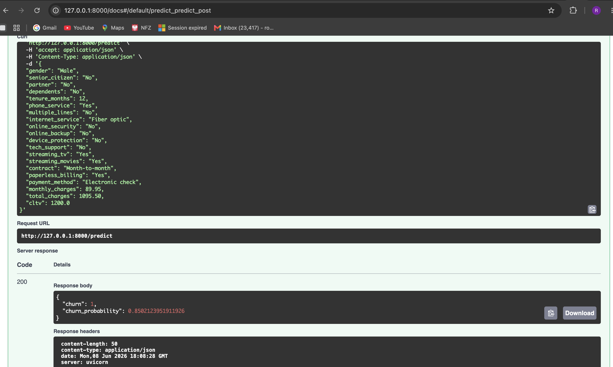
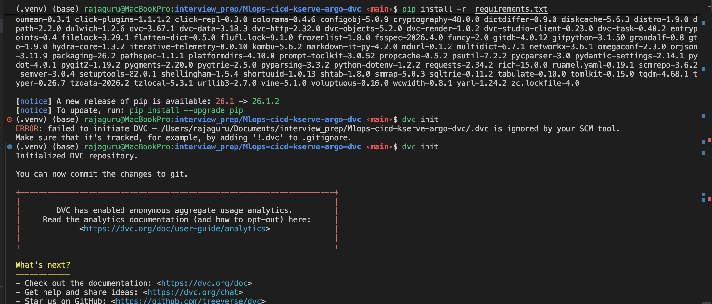
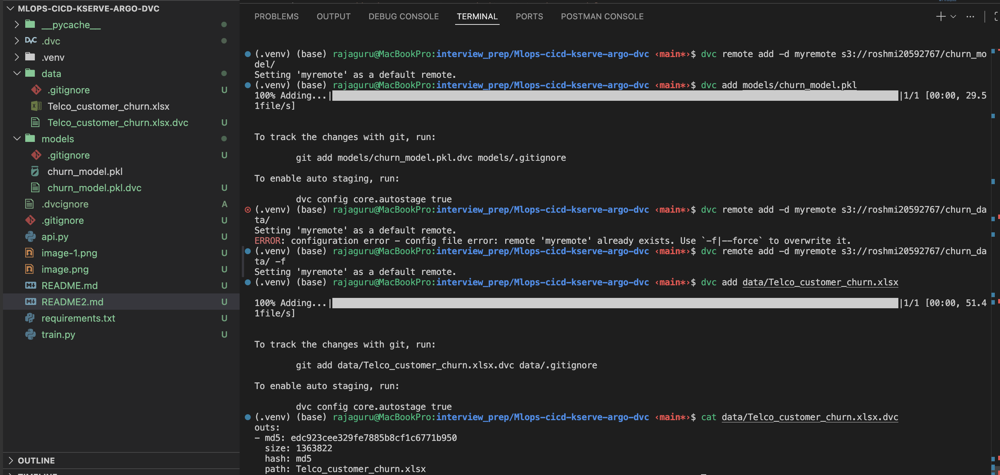
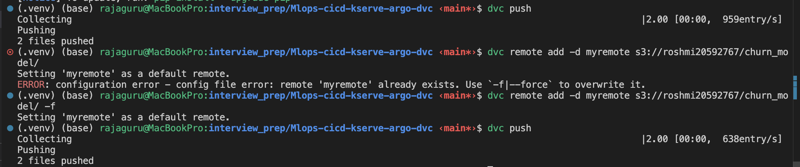
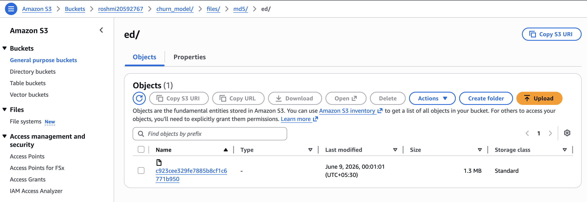
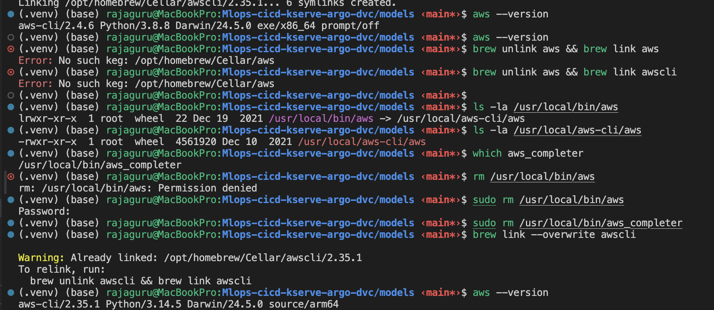
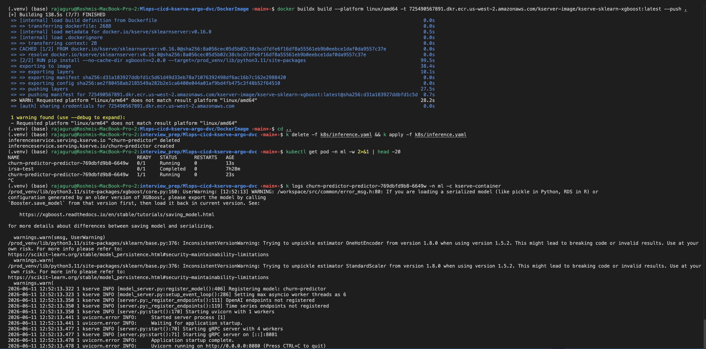
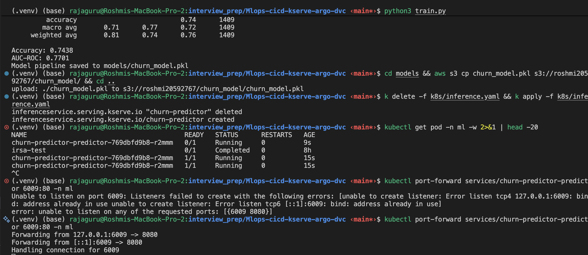
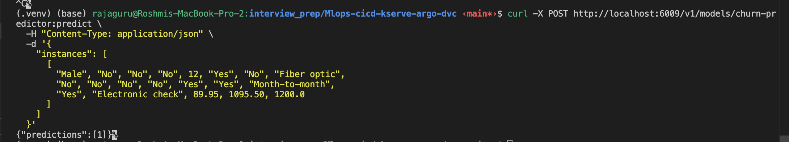

# Churn Model MLOps Demo

A simple demonstration of MLOps practices for a customer churn prediction model.

## What Does This Model Do?

**Real-World Example:**

Imagine you run a telecom company with thousands of customers. Some customers are happy and stay for years, while others leave (churn) after a few months. This model predicts which customers are likely to leave.

**Example Customer:**
- **Sarah** is 45 years old
- Been a customer for 24 months
- Pays $79.99/month
- Total spent: $1,920
- Called customer support 3 times this month

**Model Prediction:**
```json
{
  "churn": 1,
  "churn_probability": 0.73
}
```

**Translation:** Sarah has a **73% chance of canceling her subscription**. Why? She's calling support frequently (unhappy) and paying relatively high fees. Your business can now:
- Offer her a discount
- Reach out with personalized support
- Prevent losing her before she leaves

**The model looks at patterns** like:
- High monthly charges → More likely to churn
- More support calls → Customer is frustrated
- Low tenure → Haven't built loyalty yet

This helps businesses **save customers proactively** instead of reacting after they've already left!

## Project Structure

```
churn-model/
├── generate_data.py          # Generate synthetic churn dataset
├── train.py                   # Train the model
├── api.py                     # FastAPI inference server
├── requirements.txt           # Python dependencies
├── Dockerfile                 # Container image
├── .dvc/config               # DVC configuration
├── models/
│   └── churn_model.pkl.dvc   # DVC metadata for model
├── k8s/
│   ├── deployment.yaml       # Kubernetes deployment
│   └── inference.yaml        # KServe inference service
├── .github/workflows/
│   └── mlops-pipeline.yaml   # GitHub Actions CI/CD
└── argocd/
    └── application.yaml      # ArgoCD application
```

## MLOps Pipeline Steps

### 1. Initial Setup

```bash
# Install dependencies
pip install -r requirements.txt

# Generate dataset
# python generate_data.py

# Train model
python train.py

# Test API locally
python3 -m py_compile api.py train.py
python api.py 
uvicorn api:app --reload
# Visit http://localhost:8000/docs
Sample CustomerData payload
{
  "gender": "Male",
  "senior_citizen": "No",
  "partner": "No",
  "dependents": "No",
  "tenure_months": 12,
  "phone_service": "Yes",
  "multiple_lines": "No",
  "internet_service": "Fiber optic",
  "online_security": "No",
  "online_backup": "No",
  "device_protection": "No",
  "tech_support": "No",
  "streaming_tv": "Yes",
  "streaming_movies": "Yes",
  "contract": "Month-to-month",
  "paperless_billing": "Yes",
  "payment_method": "Electronic check",
  "monthly_charges": 89.95,
  "total_charges": 1095.50,
  "cltv": 1200.0
}

cltv stands for Customer Lifetime Value.

It is an estimate of the total revenue a customer will generate over the entire relationship with the company. In churn prediction, higher cltv often means the customer is more valuable, so retaining them is especially important.
```



### 2. DVC Setup (Data Version Control)









```bash
# Initialize DVC
dvc init

# Configure S3 remote
# -d is for default remote, if we dont specify a remote during push/pull dvc will use this
# -f to forcely change remote
dvc remote add myremote s3://roshmi20592767/churn_model/
dvc remote add -d data_remote  s3://roshmi20592767/churn_data/

# Track model with DVC
dvc add models/churn_model.pkl
dvc add data/Telco_customer_churn.xlsx 

# Push to S3
dvc push
# dvc push models/churn_model.pkl.dvc -r myremote
# dvc push data/Telco_customer_churn.xlsx  --remote  data_remote

# Commit DVC metadata
add .dvc in .gitignore
git add models/churn_model.pkl.dvc  .gitignore data/Telco_customer_churn.xlsx.dvc
git commit -m "Track model with DVC"
```

### 3. Push Model to S3

Model should not be pushed to dvc, remove .dvc file from models folder
DVC is used for versioning large files.
With dvc a model promotion from dev to stg to prod can not be done

```
dvc remote remove myremote
dvc remote list           
data_remote     s3://roshmi20592767/churn_data/ (default)

dvc pull :- to pull the files from remote
```

After training the model and setting up DVC:

```bash
# Configure AWS credentials (if not already done)
export AWS_ACCESS_KEY_ID=your-key
export AWS_SECRET_ACCESS_KEY=your-secret
export AWS_DEFAULT_REGION=us-east-1

# Create S3 bucket
aws s3 mb s3://my-bucket

# Push model to S3 using DVC
aws s3 cp churn_model.pkl s3://roshmi20592767/churn_model/
upload: ./churn_model.pkl to s3://roshmi20592767/churn_model/churn_model.pkl

# Verify model is in S3
aws s3 ls s3://roshmi20592767/churn_model/ --recursive
```

The model will be stored in S3 at: `s3://roshmi20592767/churn_model/churn_model.pkl`

### 4. S3 Configuration

**Note:** This section is already covered in Step 3. S3 is used by DVC to store models.

### 5. Kubernetes with KIND

I used eks here :-

```
aws cloudformation delete-stack --stack-name eksctl-test-cluster-cluster --region us-west-2

eksctl create cluster --name=test-cluster2 \
                  --region=us-west-2 \
                  --zones=us-west-2a,us-west-2b \
                  --without-nodegroup \
                  --version 1.36

eksctl utils associate-iam-oidc-provider \
--region us-west-2 \
--cluster test-cluster2 \
--approve

eksctl update addon --name vpc-cni --cluster=test-cluster2

eksctl create nodegroup --cluster=test-cluster2 \
                    --region=us-west-2 \
                    --name=test-cluster2-node \
                    --node-type=t3.medium \
                    --nodes-min=1 \
                    --nodes-max=5 \
                    --node-ami-family AmazonLinux2023 \
                    --node-volume-size=20 \
                    --spot \
                    --managed \
                    --asg-access \
                    --external-dns-access \
                    --full-ecr-access \
                    --appmesh-access \
                    --alb-ingress-access \
                    --node-private-networking

aws eks update-kubeconfig --region us-west-2 --name test-cluster2

kubectl config current-context

brew  install awscli
(.venv) (base) rajaguru@MacBookPro:Mlops-cicd-kserve-argo-dvc/models ‹main*›$ ls -la /usr/local/bin/aws             
lrwxr-xr-x  1 root  wheel  22 Dec 19  2021 /usr/local/bin/aws -> /usr/local/aws-cli/aws

```



```bash
# Create KIND cluster
kind create cluster --name churn-model
```

### 6. KServe Setup

# Install KServe
About Kserve :-

https://github.com/RoshmiB/mlops-zero-to-hero/blob/main/08-kserve/01-Introduction.md

What is KServe?
KServe is a Kubernetes-native platform designed to deploy and serve ML models easily, reliably, and at scale.

In even simpler words: KServe takes your ML model and turns it into a production-ready API running on Kubernetes without you writing a lot of server code.
Why KServe Exists?
Traditional model deployment is painful:

You need to write Flask or FastAPI code
You need to containerize the app
You need to expose endpoints
You need to manage scaling, logging, networking
You need to monitor and version your models
KServe removes most of this effort by providing standardized, ready-to-use model servers.

What KServe Actually Does?
KServe provides:

Standard Model Servers
For popular frameworks like:

TensorFlow
PyTorch
Scikit-learn
XGBoost
ONNX
You simply point KServe to your model file (a storage URI), and it deploys everything automatically.

Automatic Scaling
Your model API can:

Scale up when traffic increases
Scale down to zero when idle (saving huge costs)
This is powered by Knative under the hood.


Steps :-
```bash
# kubectl apply -f https://github.com/kserve/kserve/releases/download/v0.11.0/kserve.yaml

kubectl apply -f https://github.com/cert-manager/cert-manager/releases/latest/download/cert-manager.yaml
kubectl create namespace kserve

helm install kserve-crd oci://ghcr.io/kserve/charts/kserve-crd \
  --version v0.16.0 \
  -n kserve \
  --wait

helm install kserve oci://ghcr.io/kserve/charts/kserve \
  --version v0.16.0 \
  -n kserve \
  --set kserve.controller.deploymentMode=RawDeployment \
  --wait

k get pods -A | grep kserve
kserve         kserve-controller-manager-88cdd4954-82xzl   2/2     Running   0          15m


```


By default s3 bucket is not public in organization, we can not directly put s3 url in 
interference.yml , we need to create service account.
The secret in service account will have the aws creds.


# Create namespace, ServiceAccount and S3 secret for KServe
k create ns ml             
namespace/ml created

# Create the IAM role for EKS IRSA + S3 access

1. Confirm your EKS OIDC provider exists

aws eks describe-cluster --name test-cluster2 --query "cluster.identity.oidc.issuer" --output text
https://oidc.eks.us-west-2.amazonaws.com/id/067F276E5334D49B03B7B9E20CAFCA75

2. Get the OIDC provider ARN and issuer host

AWS_ACCOUNT_ID=$(aws sts get-caller-identity --query Account --output text)
REGION=us-west-2
CLUSTER_NAME=test-cluster2

OIDC_ISSUER=$(aws eks describe-cluster --name "$CLUSTER_NAME" --query "cluster.identity.oidc.issuer" --output text)
OIDC_PROVIDER=${OIDC_ISSUER#https://}
OIDC_PROVIDER_ARN="arn:aws:iam::$AWS_ACCOUNT_ID:oidc-provider/$OIDC_PROVIDER"

echo "$OIDC_PROVIDER"
oidc.eks.us-west-2.amazonaws.com/id/067F276E5334D49B03B7B9E20CAFCA75

echo "$OIDC_PROVIDER_ARN"
arn:aws:iam::725490567891:oidc-provider/oidc.eks.us-west-2.amazonaws.com/id/067F276E5334D49B03B7B9E20CAFCA75

3. Create the trust policy JSON

{
  "Version": "2012-10-17",
  "Statement": [
    {
      "Effect": "Allow",
      "Principal": {
        "Federated": "arn:aws:iam::725490567891:oidc-provider/oidc.eks.us-west-2.amazonaws.com/id/067F276E5334D49B03B7B9E20CAFCA75"
      },
      "Action": "sts:AssumeRoleWithWebIdentity",
      "Condition": {
        "StringEquals": {
          "oidc.eks.us-west-2.amazonaws.com/id/067F276E5334D49B03B7B9E20CAFCA75:sub": "system:serviceaccount:ml:sa-s3-access",
          "oidc.eks.us-west-2.amazonaws.com/id/067F276E5334D49B03B7B9E20CAFCA75:aud": "sts.amazonaws.com"
        }
      }
    }
  ]
}

4. Create the IAM role
aws iam create-role \
  --role-name eks-ml-s3-access-role \
  --assume-role-policy-document file://trust-policy.json

5. Attach S3 permissions
For read-only access:

aws iam attach-role-policy \
  --role-name eks-ml-s3-access-role \
  --policy-arn arn:aws:iam::aws:policy/AmazonS3ReadOnlyAccess

6. Annotate your Kubernetes ServiceAccount with role arn
7. Apply the ServiceAccount


# Update k8s/serviceaccount.yaml with your AWS credentials first
kubectl apply -f k8s/serviceaccount.yaml
k get sa -n ml             
NAME           AGE
default        10h
sa-s3-access   106s

# Deploy inference service
keep s3 model bucket uri and change ns
kubectl apply -f k8s/inference.yaml

# Check inference service
k get pods -n ml -w                
NAME                                         READY   STATUS       RESTARTS     AGE
churn-predictor-predictor-5d4586697d-nfmgj   0/1     Init:Error   1 (5s ago)   13s
kubectl get inferenceservice -n churn-model








# Wait for it to be ready

kubectl get inferenceservice churn-predictor -n churn-model -w


```

<!-- **Important:** Before deploying, update `k8s/serviceaccount.yaml` with your actual AWS credentials. -->

### 7. Test KServe Inference


```bash
# Get the inference service URL
INGRESS_HOST=$(kubectl get inferenceservice churn-predictor -n churn-model -o jsonpath='{.status.url}' | cut -d/ -f3)
SERVICE_HOSTNAME=$(kubectl get inferenceservice churn-predictor -n churn-model -o jsonpath='{.status.url}' | cut -d/ -f3)

# For local KIND cluster, port-forward
kubectl port-forward -n churn-model service/churn-predictor-predictor-default 8080:80

# Test prediction with curl
# Note: sklearn models expect data as arrays, not named features
# Order: age, tenure_months, monthly_charges, total_charges, num_support_calls
curl -X POST http://localhost:6009/v1/models/churn-predictor:predict \
  -H "Content-Type: application/json" \
  -d '{
    "instances": [
      {
      "gender": "Male",
      "senior_citizen": "No",
      "partner": "No",
      "dependents": "No",
      "tenure_months": 12,
      "phone_service": "Yes",
      "multiple_lines": "No",
      "internet_service": "Fiber optic",
      "online_security": "No",
      "online_backup": "No",
      "device_protection": "No",
      "tech_support": "No",
      "streaming_tv": "Yes",
      "streaming_movies": "Yes",
      "contract": "Month-to-month",
      "paperless_billing": "Yes",
      "payment_method": "Electronic check",
      "monthly_charges": 89.95,
      "total_charges": 1095.50,
      "cltv": 1200.0
    }
    ]
  }'
```

Expected response:
```json
{
  "predictions": [1]
}
```

### 8. GitHub Actions

**Required Secrets:**
- `AWS_ACCESS_KEY_ID`
- `AWS_SECRET_ACCESS_KEY`

**Pipeline Flow:**
1. Checkout code
2. Generate dataset
3. Train model
4. Push model to S3 via DVC
5. Build Docker image
6. Push image to ECR
7. Update `inference.yaml` with new image tag
8. Commit changes (triggers ArgoCD)

### 9. ArgoCD (GitOps)

```bash
# Install ArgoCD
kubectl create namespace argocd
kubectl apply -n argocd -f https://raw.githubusercontent.com/argoproj/argo-cd/stable/manifests/install.yaml

# Deploy application
kubectl apply -f argocd/application.yaml

# Access ArgoCD UI
kubectl port-forward svc/argocd-server -n argocd 8080:443

# Get admin password
kubectl -n argocd get secret argocd-initial-admin-secret -o jsonpath="{.data.password}" | base64 -d
```

## Complete MLOps Workflow

1. **Developer pushes code** → GitHub
2. **GitHub Actions triggered:**
   - Trains model
   - Pushes model to S3 (DVC)
   - Builds Docker image
   - Pushes to ECR
   - Updates `inference.yaml`
3. **ArgoCD detects change** in `inference.yaml`
4. **ArgoCD syncs** → Deploys to Kubernetes
5. **KServe serves** the new model version

## API Usage

```bash
curl -X POST http://localhost:8000/predict \
  -H "Content-Type: application/json" \
  -d '{
    {
      "gender": "Male",
      "senior_citizen": "No",
      "partner": "No",
      "dependents": "No",
      "tenure_months": 12,
      "phone_service": "Yes",
      "multiple_lines": "No",
      "internet_service": "Fiber optic",
      "online_security": "No",
      "online_backup": "No",
      "device_protection": "No",
      "tech_support": "No",
      "streaming_tv": "Yes",
      "streaming_movies": "Yes",
      "contract": "Month-to-month",
      "paperless_billing": "Yes",
      "payment_method": "Electronic check",
      "monthly_charges": 89.95,
      "total_charges": 1095.50,
      "cltv": 1200.0
    }
  }'
```

Response:
```json
{
  "churn": 1,
  "churn_probability": 0.73
}
```

## Key Components

- **DVC**: Version control for data and models in S3
- **S3**: Remote storage for models and data
- **KServe**: Serverless ML inference on Kubernetes
- **KIND**: Local Kubernetes for testing
- **GitHub Actions**: CI/CD automation
- **ArgoCD**: GitOps continuous deployment

## Notes

- Replace `your-registry` in YAML files with your actual container registry
- Replace `your-org` with your GitHub organization
- Replace `my-bucket` with your S3 bucket name
- This is a minimal demo - production setups require monitoring, logging, and security hardening